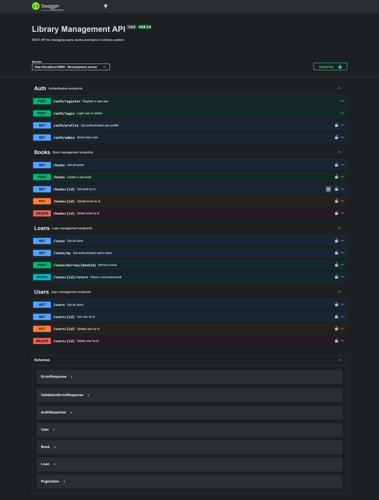

# Library Management API

A RESTful Library Management API built with Node.js, Express, TypeScript, MySQL and Docker.

The project provides authentication, role-based authorization, book management, user management, loan management, pagination, filtering, validation, Swagger documentation and administrative statistics.

## API Documentation

### Swagger UI



## Features

### Authentication

* JWT Authentication
* User Registration
* User Login
* User Profile
* Update Profile
* Change Password
* Forgot Password
* Reset Password
* Email Password Recovery
* Role-Based Authorization
* Admin Protected Routes

### Users

* Get All Users
* Get User By Id
* Update User
* Soft Delete User
* Pagination
* Search by Name or Email
* Filter by Role

### Books

* Get All Books
* Get Book By Id
* Create Book
* Update Book
* Soft Delete Book
* Search by Title, Author or ISBN
* Filter by Category
* Filter Available Books
* Pagination
* Duplicate ISBN Protection

### Loans

* Borrow Book
* Return Book
* Get User Loans
* Get All Loans (Admin)
* Filter by Status
* Filter by User
* Filter by Book
* Pagination
* Automatic Late Loan Detection

### Dashboard

Administrative statistics endpoint:

* Total Users
* Total Books
* Total Available Books
* Active Loans
* Returned Loans
* Late Loans

### Architecture

* Layered Architecture
* Controllers
* Services
* Repositories
* Middleware
* DTO Validation with Zod
* Global Error Handler
* Swagger Documentation
* Password Recovery Tokens
* Email Service (Nodemailer)

## Tech Stack

* Node.js
* Express
* TypeScript
* MySQL
* Docker
* JWT
* Zod
* Swagger
* Nodemailer
* bcryptjs

## Project Structure

```text
docs
src
├── config
├── controllers
├── database
├── errors
├── middlewares
├── models
├── repositories
├── routes
├── scripts
├── services
├── types
├── utils
├── validations
├── app.ts
└── server.ts
```

## Installation

### Clone Repository

```bash
git clone https://github.com/NicolauAlfredo/library-management-api.git
```

```bash
cd library-management-api
```

### Install Dependencies

```bash
npm install
```

## Environment Variables

Create a `.env` file:

```env
# SERVER CONFIGURATION 

# Application running port
PORT=8000

# MYSQL DATABASE CONFIGURATION 

# Database host
# DB_HOST=localhost
DB_HOST=localhost

# Default MySQL port
DB_PORT=3307

# MySQL username
DB_USER=root

# MySQL password
DB_PASSWORD=your_password

# Database name
DB_NAME=library_management_api
 
# JWT secret key used to sign authentication tokens
JWT_SECRET=your_secret_key

# Date expires
JWT_EXPIRES_IN=1d

# FRONTEND URL
FRONTEND_URL=http://localhost:5173

# SMTP CONFIGURATION
SMTP_HOST=smtp.gmail.com
SMTP_PORT=465
SMTP_SECURE=true
SMTP_USER=your_email@gmail.com
SMTP_PASS=your_app_password
SMTP_FROM=your_email@gmail.com
```

## Running with Docker

Start containers:

```bash
docker compose up -d
```

Check containers:

```bash
docker ps
```

Stop containers:

```bash
docker compose down
```

## Running the API

Development mode:

```bash
npm run dev
```

Production mode:

```bash
npm run build
npm start
```

## Create Admin User

Generate a random administrator account:

```bash
npm run create-admin
```

Example output:

```text
Admin created successfully

Name: Library Administrator 4821
Email: admin4821@library.com
Password: A7kP9qLm2X
```

## API Documentation

Swagger UI:

```text
http://localhost:8000/api-docs
```

## Authentication

Protected routes require a JWT token.

Example:

```http
Authorization: Bearer YOUR_TOKEN
```

## Main Endpoints

### Authentication

```http
POST  /api/auth/register
POST  /api/auth/login
POST  /api/auth/forgot-password
POST  /api/auth/reset-password

GET   /api/auth/profile
PATCH /api/auth/profile
PATCH /api/auth/change-password

GET   /api/auth/admin
```

### Books

```http
GET    /api/books
GET    /api/books/:id
POST   /api/books
PUT    /api/books/:id
DELETE /api/books/:id
```

Examples:

```http
GET /api/books?page=1&limit=10
```

```http
GET /api/books?search=clean
```

```http
GET /api/books?category=Software Engineering
```

```http
GET /api/books?available=true
```

### Users

```http
GET    /api/users
GET    /api/users/:id
PUT    /api/users/:id
DELETE /api/users/:id
```

Examples:

```http
GET /api/users?page=1&limit=10
```

```http
GET /api/users?search=john
```

```http
GET /api/users?role=ADMIN
```

### Loans

```http
GET    /api/loans
GET    /api/loans/my
POST   /api/loans/borrow/:bookId
PATCH  /api/loans/:id/return
PATCH  /api/loans/update-overdue
```

Examples:

```http
GET /api/loans?status=ACTIVE
```

```http
GET /api/loans?userId=1
```

```http
GET /api/loans?bookId=2
```

### Dashboard

```http
GET /api/dashboard/admin
```

## Soft Delete

Users and books are not physically removed from the database.

Deleted records receive a value in:

```sql
deleted_at
```

and are automatically excluded from API queries.

## Security Features

* Password Hashing with bcrypt
* JWT Authentication
* Protected Routes
* Role-Based Authorization
* Single-Use Password Reset Tokens
* Expiring Password Reset Tokens
* Soft Delete Strategy
* Input Validation with Zod
  
## Future Improvements

* Refresh Tokens
* Unit Tests
* Integration Tests
* Rate Limiting
* Request Logging with Pino
* Role Permissions Management
* Book Reservations
* Fine Management System
* Email Templates
* CI/CD Pipeline

## License

This project was developed for educational and portfolio purposes.
